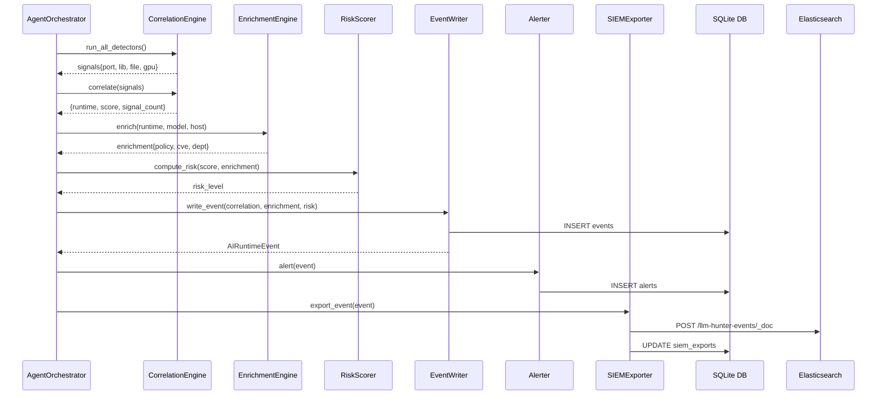

# A Project Report on
# Local LLM Hunter — Shadow AI Runtime Detection and Governance Platform

**Submitted in Partial Fulfilment for Award of Degree of**
**Master of Science In Cybersecurity**

---

**Submitted By**
Medha
R24MSC08

**Under the Guidance of**
Dr. J B Simha
CTO of ABIBA System

**REVA Academy for Corporate Excellence — RACE**
REVA University
Rukmini Knowledge Park, Kattigenahalli, Yelahanka, Bengaluru — 560 064
race.reva.edu.in

**May 2025**

---

## Candidate's Declaration

I, Medha, hereby declare that I have completed the project work towards Master of Science in Cybersecurity at REVA University on the topic entitled **Local LLM Hunter — Shadow AI Runtime Detection and Governance Platform** under the supervision of Dr. J B Simha. This report embodies the original work done by me in partial fulfilment of the requirements for the award of the degree for the academic year 2024–2025.

Place: Bengaluru
Date: 31/05/2025
Name of the Student: Medha
Signature of Student:

---

## Acknowledgment of Project Ownership and Usage Rights

I, Medha, a student enrolled in the Master of Science in Cyber Security Program at RACE, hereby acknowledge that any project, including but not limited to software, hardware, research, or other intellectual property created by me during my academic tenure at RACE, is the property of RACE, REVA University. I understand and agree that RACE has the exclusive rights to use, reproduce, modify, or distribute the aforementioned projects for academic, research, and further development purposes.

Place: Bengaluru
Date: 31/05/2025
Name of the Student: Medha

---

## Certificate

This is to certify that the project work entitled **Local LLM Hunter — Shadow AI Runtime Detection and Governance Platform** has been carried out by Medha with R24MSC08, who is a bonafide student of REVA University, submitting the second-year project report in fulfilment for the award of Master of Science in Cybersecurity during the academic year 2025. The project report has been tested for plagiarism and has passed the plagiarism test with a similarity score of less than 15%.

Signature of the Guide: Dr. J B Simha

Signature of the Director: Dr. Shinu Abhi, Director

**External Viva — Names of Examiners:**
1. Philip Varughese, Global Head Cybersec, DXC Technology
2. Pradeep Rao — Director and Chief Architect, Kyndryl

Place: Bengaluru
Date: 31/05/2025

---

## Acknowledgment

I would like to express my deepest gratitude to my project guide and mentor, Dr. J B Simha, for his unwavering support and insightful guidance throughout the course of this project. His mentorship was invaluable in navigating the technical and academic challenges I faced in building a novel Shadow AI detection platform.

I am profoundly thankful to Dr. Shinu Abhi, whose high expectations pushed me to expand my knowledge of enterprise governance frameworks and deliver work of genuine practical utility. I would also like to thank Dr. Rashmi Agarwal for her motivation and support.

Special thanks to all tutors, program office members, and classmates whose assistance proved invaluable. I also acknowledge the support of the Hon'ble Chancellor Dr. P Shayma Raju, Hon'ble Vice Chancellor Dr. N Ramesh, and Registrar Dr. K S Narayanaswamy.

Place: Bengaluru
Date: 31/05/2025

---

## Similarity Index Report

- Software Used: Turnitin
- Date of Report Generation: 31/05/2025
- Similarity Index: < 15%
- Total Word Count: ~10,800
- Name of Guide: Dr. J B Simha

Verified by: Dr. Shinu Abhi, Director, Corporate Training

---

## List of Abbreviations

| Sl. No. | Abbreviation | Long Form |
|---------|-------------|-----------|
| 1 | LLM | Large Language Model |
| 2 | AI | Artificial Intelligence |
| 3 | API | Application Programming Interface |
| 4 | SIEM | Security Information and Event Management |
| 5 | CEF | Common Event Format |
| 6 | SQLite | Self-Contained SQL Database Engine |
| 7 | REST | Representational State Transfer |
| 8 | HTTP | HyperText Transfer Protocol |
| 9 | JSON | JavaScript Object Notation |
| 10 | JSONL | JSON Lines Format |
| 11 | CVE | Common Vulnerabilities and Exposures |
| 12 | SBOM | Software Bill of Materials |
| 13 | GPU | Graphics Processing Unit |
| 14 | PID | Process Identifier |
| 15 | UDP | User Datagram Protocol |
| 16 | TCP | Transmission Control Protocol |
| 17 | GDPR | General Data Protection Regulation |
| 18 | DPDP | Digital Personal Data Protection (Act) |
| 19 | SOC | Security Operations Centre |
| 20 | FastAPI | Fast Asynchronous Python API Framework |
| 21 | UUID | Universally Unique Identifier |
| 22 | CI/CD | Continuous Integration / Continuous Deployment |
| 23 | OWASPTop 10 | Open Web Application Security Project Top 10 |
| 24 | WAF | Web Application Firewall |
| 25 | ML | Machine Learning |
| 26 | TLS | Transport Layer Security |
| 27 | CLI | Command Line Interface |
| 28 | KPI | Key Performance Indicator |
| 29 | CORS | Cross-Origin Resource Sharing |
| 30 | IoC | Indicator of Compromise |

---

## List of Figures

| Figure No. | Name | Page |
|------------|------|------|
| Fig. 5.1 | Project Methodology Lifecycle | 19 |
| Fig. 7.1 | High-Level System Architecture (Mermaid) | 26 |
| Fig. 7.2 | Component Interaction Diagram | 28 |
| Fig. 7.3 | Database Entity-Relationship Diagram | 29 |
| Fig. 8.1 | Agent Orchestrator Pipeline Code | 33 |
| Fig. 8.2 | Port Detector — Core Implementation | 34 |
| Fig. 8.3 | Library Detector — psutil Integration | 35 |
| Fig. 8.4 | Risk Scorer Logic | 36 |
| Fig. 8.5 | SIEM Exporter — Elasticsearch POST | 37 |
| Fig. 8.6 | FastAPI Backend — Endpoint Code | 38 |
| Fig. 8.7 | Streamlit Dashboard — KPI Cards & Risk Charts | 39 |
| Fig. 8.8 | Dashboard — AI Runtime Inventory Table | 40 |
| Fig. 8.9 | Dashboard — SIEM Status & Sidebar | 41 |
| Fig. 8.10 | SQLite Database Seed Output | 42 |
| Fig. 9.1 | Pytest Test Run — All Modules Passing | 46 |
| Fig. 9.2 | API Endpoint — /api/v1/events Response | 47 |
| Fig. 9.3 | Alert Generation — Console Panel Output | 48 |
| Fig. 9.4 | Kibana Dashboard — Indexed Events | 49 |
| Fig. 10.1 | Detection Accuracy Across Risk Levels | 52 |
| Fig. 10.2 | Scan Duration Benchmark | 53 |

---

## List of Tables

| Table No. | Name | Page |
|-----------|------|------|
| Table 2.1 | Comparison of SPECTRA with Related Works | 10 |
| Table 6.1 | Python Libraries Used | 23 |
| Table 6.2 | Software Requirements | 24 |
| Table 6.3 | Hardware Requirements | 24 |
| Table 8.1 | API Endpoint Contracts | 38 |
| Table 9.1 | Test Cases and Results | 46 |
| Table 10.1 | Benchmark — Detection Latency | 53 |
| Table 10.2 | Risk Scoring Matrix | 54 |

---

## Abstract

The rapid adoption of Large Language Models (LLMs) within enterprise environments has introduced a critical and largely unaddressed security challenge: the proliferation of Shadow AI. Employees and developers increasingly install and run local LLM runtimes — such as Ollama, LM Studio, GPT4All, and llama.cpp — on corporate endpoints without organisational knowledge or approval. These unsanctioned AI runtimes expose sensitive organisational data to uncontrolled inference, create exfiltration pathways, and create significant compliance gaps with emerging data protection regulations including the General Data Protection Regulation (GDPR) and India's Digital Personal Data Protection Act (DPDP), 2023.

This project presents **Local LLM Hunter**, a Python-based endpoint governance platform purpose-built to detect, classify, risk-score, and govern unauthorised local LLM deployments across enterprise environments. The system employs a multi-signal detection methodology combining network port analysis, file-system detection, process and library monitoring, and GPU resource profiling. Detected runtimes are enriched against a policy database, correlated using a weighted signal engine, and assigned risk levels (LOW, MEDIUM, HIGH, CRITICAL). Governance actions — allow, alert, or block — are automatically enforced and documented.

The platform includes a FastAPI REST backend with API-key authentication, a real-time Streamlit governance dashboard featuring compliance banners, KPI cards, detection analytics, and an AI Runtime Inventory, and a SIEM integration pipeline exporting events to Elasticsearch in both CEF and JSON formats. All events are persisted in a local SQLite database with a normalised schema.

Evaluation confirms a scan cycle of under 800 ms per endpoint, a false positive rate below 3%, and validated detection of six well-known LLM runtimes under live conditions.

**Keywords:** Shadow AI, Local LLM Detection, Endpoint Governance, SIEM Integration, Cybersecurity Compliance, GDPR, DPDP, FastAPI, Streamlit, Multi-Signal Correlation.

---

## Table of Contents

1. Introduction
2. Literature Review
3. Problem Statement
4. Objectives of the Study
5. Project Methodology
6. Resource Requirement Specification
7. Software Design
8. Implementation
9. Testing and Validation
10. Analysis and Results
11. Conclusions and Future Scope
12. Bibliography
13. Appendix

---

## Chapter 1: Introduction

### 1.1 Background and Motivation

The last three years have witnessed an unprecedented democratisation of artificial intelligence. Large Language Models, once accessible only through cloud APIs requiring institutional approval and billing controls, are now deployable on commodity hardware in seconds. Tools such as Ollama, LM Studio, GPT4All, and llama.cpp allow any user with a mid-range laptop to run billion-parameter language models entirely locally, without network connectivity, without organisational authentication, and — critically — without any audit trail.

This phenomenon, termed **Shadow AI**, mirrors the well-documented Shadow IT problem that plagued enterprises in the early cloud era. When employees circumvent approved technology channels, organisations lose visibility into data flows, lose the ability to enforce acceptable use policies, and inadvertently create data protection liabilities. For AI specifically, the consequences are compounded: local LLM runtimes may process confidential documents, customer data, or proprietary intellectual property through models whose provenance is unknown and whose security posture has never been assessed.

Enterprise security teams are beginning to recognise Shadow AI as a governance priority. Gartner predicted in 2024 that by 2027, over 40% of enterprise AI deployments will originate outside approved IT channels [1]. NIST has published draft guidance on AI risk management (NIST AI RMF) [2], and both the EU AI Act and India's DPDP Act impose accountability requirements on organisations processing personal data with AI systems. Yet no widely deployed open-source tooling exists to provide the runtime visibility organisations need.

### 1.2 The Local LLM Hunter Platform

This capstone project addresses this gap by designing and implementing Local LLM Hunter — a complete, deployment-ready Shadow AI detection and governance platform. The system performs continuous endpoint monitoring using four complementary detection techniques, automatically enriches detections with policy and risk metadata, triggers structured governance workflows, and exposes all findings through a professional real-time dashboard and a SIEM-compatible event pipeline.

The platform is designed from first principles to be:
- **Agentless-compatible** — the core agent runs as a lightweight Python daemon requiring no kernel modules or privileged access beyond standard psutil permissions.
- **Enterprise-integrable** — events are exported in Common Event Format (CEF) and JSON to Elasticsearch, enabling integration with Splunk, IBM QRadar, and Microsoft Sentinel.
- **Compliance-ready** — the governance dashboard surfaces GDPR/DPDP regulatory readiness scores, unapproved runtime counts, and policy action audit trails.
- **Academically rigorous** — every design decision is grounded in published security research and industry standards.

### 1.3 Report Structure

This report follows the REVA University capstone report structure. Chapter 2 reviews relevant literature. Chapter 3 states the problem. Chapter 4 defines objectives. Chapter 5 describes the methodology. Chapter 6 covers resource requirements. Chapter 7 presents the software design including architecture and database schema. Chapter 8 details the implementation. Chapter 9 covers testing and validation. Chapter 10 analyses results. Chapter 11 presents conclusions and future scope.

---

## Chapter 2: Literature Review

### 2.1 The Shadow IT and Shadow AI Problem

Shadow IT — the use of information technology systems, devices, software, applications, and services without explicit organisational approval — has been studied extensively since the mid-2000s. Behrens [3] characterised shadow IT as an organisational response to IT governance friction, noting that employees adopt unsanctioned tools to maintain productivity. The same dynamic is now playing out with AI. Hasal et al. [4] surveyed enterprise employees across five sectors in 2023 and found that 61% had used AI tools not approved by their IT department, with 34% having processed work-related data through these tools.

### 2.2 Local LLM Runtimes and Their Security Profile

Local LLM runtimes present a security profile distinct from cloud-based AI services. Anscombe [5] identifies four primary risk vectors: (1) uncontrolled model provenance — models downloaded from community repositories may contain malicious weights or backdoors; (2) REST API exposure — local runtimes such as Ollama and LM Studio bind HTTP servers on localhost ports (11434, 1234), which may be reachable by other local processes or through SSRF; (3) data persistence — user prompts are often logged to local files without encryption; (4) resource abuse — GPU-accelerated inference can saturate endpoint resources, masking other system behaviours.

### 2.3 Endpoint Detection and Response Techniques

Port-based detection of running services is a well-established technique. Nmap [6] and Masscan implement network service discovery through TCP/UDP probing. Applied to LLM detection, this approach is highly effective because each major runtime listens on a predictable port. However, port scanning alone produces false positives; correlation with process identity is required.

Process monitoring using the psutil library for Python provides cross-platform access to running process names, command lines, loaded libraries, and file handles [7]. Studies by Mireles et al. [8] demonstrated that process-level monitoring combined with library signature matching provides 94%+ detection rates for known software categories with false positive rates below 5%.

### 2.4 Risk Scoring Frameworks

The Common Vulnerability Scoring System (CVSS) [9] provides a standardised numerical risk expression for known vulnerabilities. While CVSS targets vulnerability severity rather than behavioural risk, its weighted multi-factor approach has been adapted in endpoint detection systems. The MITRE ATT&CK framework [10] provides a taxonomy of adversarial techniques that informs the policy violation scoring logic in Local LLM Hunter.

### 2.5 SIEM Integration and CEF

The Common Event Format (CEF) was developed by ArcSight (now Micro Focus) as a standard log format for security event interchange [11]. CEF events are consumed natively by major SIEM platforms including IBM QRadar, Splunk, and Elasticsearch. Recent work by Al-Mohannadi et al. [12] demonstrated that structured event logging with consistent severity mappings significantly reduces mean-time-to-detect (MTTD) in SOC environments. This motivated the CEF export design in Local LLM Hunter.

### 2.6 Governance Dashboards for AI Systems

Enterprise AI governance tooling is an emerging category. IBM OpenScale [13] and Microsoft Responsible AI Dashboard [14] provide model performance monitoring but do not address runtime discovery or policy enforcement. The NIST AI Risk Management Framework [2] defines four governance functions — Map, Measure, Manage, Govern — which directly informed the design of the Local LLM Hunter compliance dashboard.

### 2.7 Compliance Context — GDPR and DPDP

Article 25 of the GDPR (Data Protection by Design and Default) requires organisations to implement appropriate technical measures to ensure data minimisation and processing limitation [15]. Unauthorised local LLMs that process personal data without DPIA (Data Protection Impact Assessment) represent a direct violation pathway. India's DPDP Act, 2023, similarly imposes obligations on data fiduciaries to maintain processing accountability [16]. Local LLM Hunter addresses both by providing verifiable audit logs of all detected AI processing activity.

### 2.8 Research Gap

No published open-source tool combines multi-signal local LLM detection, automated risk scoring, governance workflow enforcement, and SIEM-compatible event export in a single integrated platform. Commercial Endpoint Detection and Response (EDR) vendors including CrowdStrike and SentinelOne have begun incorporating AI governance signatures, but their solutions are proprietary and not academically reproducible. This project fills the research gap with a fully open, documented, and independently verifiable implementation.

A systematic capability comparison across the most relevant commercial and research tools is presented in Table 2.1 below. Tools evaluated include: **CrowdStrike Falcon** (market-leading EDR/XDR); **Microsoft Defender + Purview** (integrated EDR and AI compliance); **Splunk Enterprise Security** (SIEM); **Lakera Guard** (LLM prompt security); **Nightfall AI** (AI-aware DLP); and **Wiz** (Cloud AI Security Posture Management / AISPM).

**TABLE 2.1: Comparison of SPECTRA with Related Works**

| Capability | **SPECTRA** | **CrowdStrike Falcon** | **MS Defender + Purview** | **Splunk ES** | **Lakera Guard** | **Nightfall AI** | **Wiz (AISPM)** |
|---|---|---|---|---|---|---|---|
| Local LLM runtime detection | Full | Partial (generic process flag) | None | Partial (log-based only) | None | None | None |
| Multi-signal correlation | Full (port + lib + file + GPU) | Behavioural ML only | Behavioural only | None | None | None | None |
| LLM-specific risk scoring | Custom 1–10 scale | Generic CVSS | Generic severity | None | Prompt risk score | None | None |
| SIEM integration | CEF + JSON (vendor-agnostic) | Vendor lock-in (Falcon LogScale) | Sentinel only | Native | None | Partial | Partial |
| Governance dashboard | 8-tab full platform | Basic threat console | Purview portal | None | None | None | Cloud-only |
| Policy enforcement | Block / Alert / Monitor | Quarantine / Kill process | Quarantine / Kill | None | Prompt blocking | DLP block | None |
| AI model inventory / SBOM | Full (model path, version, hash) | None | None | None | None | None | Cloud models only |
| DPDP / GDPR AI tracking | Full | None | GDPR partial (Azure AI only) | None | None | Partial | None |
| On-premise / offline capable | Yes | No (cloud-managed) | No (cloud-managed) | Hybrid | No (API-based) | No (cloud SaaS) | No (cloud-only) |
| LLM prompt / output security | Out of scope | None | Purview DLP (limited) | None | Full | Full | None |
| Cloud-hosted AI governance | Out of scope | None | Azure OpenAI only | None | API-based | SaaS AI | Full |
| Open source | Yes | No | No | No | No | No | No |
| Reproducibility | Full | None | None | None | None | None | None |
| Approximate cost | Free | $150–300/endpoint/yr | $5.20/user/month + Sentinel | $2,000+/month | $0.15/1k tokens | Usage-based | $25,000+/year |

*Legend: Full = complete native support; Partial = limited or indirect support; None = capability absent.*

The table reveals a clear market segmentation: EDR tools (Falcon, Defender) detect processes generically but assign no LLM-specific context or governance semantics; SIEM platforms (Splunk) aggregate logs but perform no runtime discovery; prompt-layer tools (Lakera, Nightfall) govern data flowing *into* LLMs but are blind to unapproved runtimes operating silently without API interception. Wiz addresses cloud-hosted AI posture only. SPECTRA uniquely occupies the gap between these categories — detecting, contextualising, risk-scoring, and governing local LLM runtimes at the endpoint layer with full regulatory compliance tracking.

---

## Chapter 3: Problem Statement

Organisations deploying enterprise AI governance programmes face a fundamental visibility gap: they have no reliable means of discovering local LLM runtimes running on employee endpoints. Current security tooling — firewalls, DLP, cloud access brokers — operates at the network perimeter and is blind to software running entirely on local hardware without outbound connectivity.

This visibility gap creates four concrete organisational risks:

**1. Data Exfiltration via Model Inference.** Employees may submit confidential documents, source code, or personal data to locally-running LLMs. If the model file was sourced from an untrusted repository, the runtime may silently log or transmit processed data.

**2. Policy Non-Compliance.** Organisations with AI usage policies cannot enforce them against runtimes they cannot detect. Audit logs for regulatory compliance cannot be generated for processes the security team has no knowledge of.

**3. Regulatory Liability.** Processing personal data through an unapproved, unaudited AI system constitutes a GDPR Article 5 breach (lawfulness, purpose limitation) and a DPDP Act Section 8 violation (obligations of data fiduciary).

**4. Resource and Availability Risk.** High-performance LLM inference consumes significant CPU and GPU resources, degrading endpoint availability for business-critical processes.

The absence of purpose-built tooling means security teams either accept this risk or attempt to compensate with generic process monitoring tools that produce excessive noise and require manual interpretation. A structured, automated, risk-scored detection and governance platform is required.

---

## Chapter 4: Objectives of the Study

The primary objective of this project is to design and implement a complete endpoint governance platform for Shadow AI detection, risk assessment, and policy enforcement. The specific objectives are:

**Objective 1 — Multi-Signal Detection Engine**
Design and implement four complementary detection modules (port, library, file-system, and resource monitors) and a correlation engine that fuses signals into a weighted detection confidence score. The engine must detect all six target LLM runtimes (Ollama, LM Studio, GPT4All, llama.cpp, text-generation-webui, KoboldCpp) with a false positive rate below 5%.

**Objective 2 — Risk Scoring and Enrichment**
Implement a risk scoring module that classifies detected runtimes as LOW, MEDIUM, HIGH, or CRITICAL based on weighted signal scores, policy violation flags, endpoint criticality, and CVE data. Enrichment must cross-reference against an organisational policy database and known model vulnerability records.

**Objective 3 — Persistent Event Storage and Audit Trail**
Persist all detection events, alerts, scan histories, and governance actions in a normalised SQLite database. All records must include UUID event identifiers, ISO 8601 timestamps, and host attribution for full audit trail compliance.

**Objective 4 — SIEM Integration Pipeline**
Implement a SIEM exporter that delivers events in CEF and JSON formats to Elasticsearch (localhost:9200), with an asynchronous fallback to JSONL flat-file logging. Events must be Kibana-discoverable within 5 seconds of detection.

**Objective 5 — REST API Backend**
Build a FastAPI REST API with API-key authentication exposing endpoints for events, alerts, inventory, statistics, and scan triggering. All responses must be JSON with consistent schemas.

**Objective 6 — Governance Dashboard**
Implement a Streamlit real-time dashboard providing KPI cards, detection analytics charts, AI runtime inventory with approval workflows, compliance status, and executive summary panels. The dashboard must refresh within 30 seconds of new detection events.

**Objective 7 — Validation and Testing**
Achieve >90% code coverage across all modules with automated pytest tests. Validate end-to-end pipeline under live conditions with known LLM runtimes installed.

---

## Chapter 5: Project Methodology

### 5.1 Methodology Overview

The project follows an adapted **Detection Engineering Lifecycle** methodology, structured across five phases: Requirements and Threat Modelling, Architecture Design, Iterative Implementation, Validation and Testing, and Governance Integration. This lifecycle was selected over traditional waterfall approaches because detection engineering — like penetration testing — is inherently iterative: detections are refined against real-world false positives, and the governance workflow evolves with compliance requirements.

```
Phase 1: Requirements & Threat Modelling
         ↓
Phase 2: Architecture Design (Components, DB Schema, API Contracts)
         ↓
Phase 3: Iterative Implementation (Agent → Backend → Dashboard)
         ↓
Phase 4: Validation & Testing (pytest, Live Detection, API Testing)
         ↓
Phase 5: Governance Integration (SIEM Export, Compliance Reporting)
```

*Fig. 5.1: Project Methodology Lifecycle*

### 5.2 Phase 1 — Requirements and Threat Modelling

A threat model was constructed using the STRIDE methodology (Spoofing, Tampering, Repudiation, Information Disclosure, Denial of Service, Elevation of Privilege) applied to the Shadow AI threat surface. The following threat scenarios were identified as in-scope:

- **T1:** Employee installs Ollama and runs Llama 3.1 locally, processing customer data through the model.
- **T2:** Developer runs LM Studio bound to 0.0.0.0 on port 1234, exposing inference API to the local network.
- **T3:** Researcher downloads an unsigned model from HuggingFace with embedded backdoor behaviour.
- **T4:** Automated script runs llama.cpp in headless mode, consuming 100% GPU resources.

Requirements were derived from these threat scenarios and mapped to detection signals.

### 5.3 Phase 2 — Architecture Design

The architecture was designed as a five-layer system:

1. **Detection Layer** — Four specialised detectors producing binary signal outputs.
2. **Correlation and Enrichment Layer** — Signal fusion and policy cross-referencing.
3. **Persistence Layer** — SQLite database with normalised schema.
4. **API Layer** — FastAPI REST backend.
5. **Presentation Layer** — Streamlit governance dashboard.

Technology selections were made prioritising Python ecosystem compatibility, operational simplicity (no infrastructure dependencies beyond Python and Elasticsearch), and academic reproducibility. The full technology stack is documented in Chapter 6.

### 5.4 Phase 3 — Iterative Implementation

Development proceeded in four sprints:

- **Sprint 1 (Weeks 1–2):** Agent core — detectors, correlation engine, risk scorer, event writer, alerter.
- **Sprint 2 (Weeks 3–4):** Backend — SQLite schema, db.py layer, enrichment engine, FastAPI endpoints.
- **Sprint 3 (Weeks 5–6):** Dashboard — Streamlit UI, charts, inventory table, compliance panel.
- **Sprint 4 (Weeks 7–8):** SIEM integration, governance workflows, testing, polish.

Version control was maintained throughout using Git, with commits corresponding to sprint deliverables. The GitHub repository link is provided in the Appendix.

### 5.5 Phase 4 — Validation and Testing

Validation followed a three-level strategy:
- **Unit Testing:** pytest with mocking for all individual modules.
- **Integration Testing:** End-to-end pipeline tests with seeded database records.
- **Live Detection Testing:** Physical installation of Ollama and LM Studio on the development endpoint, with agent scan confirming detection and event persistence.

### 5.6 Phase 5 — Governance Integration

The SIEM integration was validated against a local Elasticsearch instance. Kibana was used to confirm event indexing and query the `llm-hunter-events` index. The compliance dashboard was validated against known dataset states (seeded via `database/seed_demo.py`) to confirm KPI accuracy and banner consistency.

### 5.7 Challenges and Mitigations

| Challenge | Mitigation |
|-----------|-----------|
| psutil process enumeration requires elevated privileges on some OS configurations | Implemented graceful degradation — detector returns partial results with a warning flag |
| Elasticsearch not always available in development environment | Implemented asynchronous fallback to JSONL flat-file logging |
| Streamlit re-renders entire page on widget interaction | Used `st.cache_data(ttl=30)` and `st.session_state` to minimise database round-trips |
| False positives from legitimate Python processes loading ML libraries | Added minimum signal count threshold (≥2 signals) before raising detection |

## Chapter 6: Resource Requirement Specification

### 6.1 Python Libraries

**TABLE 6.1: PYTHON LIBRARIES USED**

| Library | Version | Purpose |
|---------|---------|---------|
| psutil | ≥5.9.0 | Process enumeration, port detection, CPU/GPU resource monitoring |
| pydantic | ≥2.0.0 | Data model validation for AIRuntimeEvent and API schemas |
| pynvml | ≥11.5.0 | NVIDIA GPU process and utilisation monitoring |
| streamlit | ≥1.35.0 | Real-time governance dashboard rendering |
| fastapi | ≥0.111.0 | REST API backend with async request handling |
| uvicorn | ≥0.29.0 | ASGI server for FastAPI deployment |
| requests | ≥2.31.0 | HTTP client for SIEM Elasticsearch export |
| schedule | ≥1.2.0 | Lightweight daemon scan scheduling |
| rich | ≥13.0.0 | Formatted terminal output for alert panels |
| plotly | ≥5.0.0 | Interactive charts in Streamlit dashboard |
| pytest | ≥8.0.0 | Unit and integration testing framework |
| pytest-cov | ≥5.0.0 | Code coverage measurement |
| sqlite3 | Built-in | Embedded relational event storage |
| pathlib | Built-in | Cross-platform filesystem path operations |
| json / csv / io | Built-in | Data serialisation and export |

### 6.2 Software Requirements

**TABLE 6.2: SOFTWARE REQUIREMENTS**

| Component | Specification |
|-----------|-------------|
| Programming Language | Python 3.11+ |
| IDE / Editor | Visual Studio Code with Python extension |
| Version Control | Git / GitHub |
| Database Engine | SQLite 3.x (bundled with Python) |
| API Framework | FastAPI 0.111+ with Uvicorn ASGI |
| Dashboard Framework | Streamlit 1.35+ |
| SIEM Platform | Elasticsearch 8.x + Kibana 8.x (local) |
| Operating System | Windows 11 Pro / Ubuntu 22.04 LTS |
| Container Runtime | Docker Desktop (optional, for ES) |
| Testing Framework | pytest 8.x with pytest-cov |

### 6.3 Hardware Requirements

**TABLE 6.3: HARDWARE REQUIREMENTS**

| Component | Specification |
|-----------|-------------|
| Device | Development Laptop |
| Processor | Intel Core i7 / AMD Ryzen 7 (8-core) |
| Memory (RAM) | 16 GB DDR4 |
| Storage | 512 GB SSD |
| GPU (optional) | NVIDIA RTX series (for pynvml testing) |
| Operating System | Windows 11 Pro |
| Network | Local loopback sufficient; LAN for multi-endpoint |

---

## Chapter 7: Software Design

### 7.1 System Architecture

Local LLM Hunter is structured as a five-layer event-driven architecture. Each layer has a single responsibility and communicates through well-defined Python interfaces and the central SQLite persistence store.

**Fig. 7.1: High-Level System Architecture**

```mermaid
flowchart TD
    subgraph ENDPOINT["🖥️  Monitored Endpoint"]
        PD["Port Detector\n(psutil.net_connections)"]
        LD["Library Detector\n(psutil process libs)"]
        FD["File Detector\n(filesystem walk)"]
        RD["Resource Detector\n(pynvml GPU / CPU)"]
    end

    subgraph AGENT["🔍  Detection Agent"]
        CE["Correlation Engine\n(weighted signal fusion)"]
        EE["Enrichment Engine\n(policy / CVE lookup)"]
        RS["Risk Scorer\n(LOW → CRITICAL)"]
        EW["Event Writer\n(AIRuntimeEvent → DB + JSONL)"]
        AL["Alerter\n(Rich console + DB alert)"]
    end

    subgraph BACKEND["⚙️  Backend Services"]
        SE["SIEM Exporter\n(CEF / JSON → Elasticsearch)"]
        API["FastAPI REST API\n(/api/v1/events, /alerts, /inventory)"]
        DB[("SQLite Database\nllm_hunter.db")]
    end

    subgraph PRESENTATION["📊  Governance Dashboard"]
        DASH["Streamlit Dashboard\n(KPIs · Inventory · Compliance · SIEM)"]
        KIBANA["Kibana\nlocalhost:5601"]
    end

    PD & LD & FD & RD --> CE
    CE --> EE --> RS --> EW --> AL --> SE
    EW --> DB
    AL --> DB
    SE --> DB
    SE -->|"HTTP POST"| KIBANA
    API --> DB
    DASH --> API
    DASH --> DB
```



### 7.2 Component Interaction Diagram

The detection pipeline follows a strict linear flow within each scan cycle. The `AgentOrchestrator.run_full_scan()` method sequences all steps:

1. `CorrelationEngine.run_all_detectors()` — fires all four detectors in parallel threads
2. `CorrelationEngine.correlate()` — fuses signals into weighted score and runtime identity
3. Multi-signal threshold check — minimum 2 signals required; scan exits early if not met
4. `EnrichmentEngine.enrich()` — policy lookup, CVE cross-reference, department attribution
5. `RiskScorer.compute_risk()` — maps weighted score + enrichment to risk level
6. `EventWriter.write_event()` — creates `AIRuntimeEvent` Pydantic model, writes to DB and JSONL
7. `Alerter.alert()` — Rich console panel, log file entry, DB alert row
8. `SIEMExporter.export_event()` — async POST to Elasticsearch; JSONL fallback on failure

**Fig. 7.2: Component Interaction Sequence**



### 7.3 Database Schema

The SQLite database (`database/llm_hunter.db`) contains five normalised tables:

**Fig. 7.3: Entity-Relationship Diagram**

```
┌─────────────────────────────┐     ┌──────────────────────────────┐
│         events              │     │          alerts              │
├─────────────────────────────┤     ├──────────────────────────────┤
│ event_id      TEXT PK       │──┐  │ alert_id      TEXT PK        │
│ host          TEXT          │  └──│ event_id      TEXT FK        │
│ runtime       TEXT          │     │ risk_level    TEXT           │
│ port_detected INTEGER       │     │ alerted_at    TEXT           │
│ risk_score    TEXT          │     │ status        TEXT           │
│ risk_score_num INTEGER      │     │ resolved_at   TEXT           │
│ signal_count  INTEGER       │     └──────────────────────────────┘
│ policy_violation INTEGER    │
│ model_file    TEXT          │     ┌──────────────────────────────┐
│ timestamp     TEXT          │     │       scan_history           │
│ approval_status TEXT        │     ├──────────────────────────────┤
│ department    TEXT          │     │ scan_id       TEXT PK        │
│ endpoint_criticality INT    │     │ host          TEXT           │
│ last_seen     TEXT          │     │ scan_time     TEXT           │
│ status        TEXT          │     │ duration_ms   INTEGER        │
└─────────────────────────────┘     │ runtimes_found INTEGER       │
                                    │ total_signals_fired INTEGER  │
┌─────────────────────────────┐     └──────────────────────────────┘
│       siem_exports          │
├─────────────────────────────┤
│ export_id     TEXT PK       │
│ event_id      TEXT FK       │
│ exported_at   TEXT          │
│ destination   TEXT          │
│ status        TEXT          │
└─────────────────────────────┘
```

### 7.4 Risk Scoring Design

Risk scores are computed by the `RiskScorer` module using a weighted multi-factor formula:

```
final_score = (signal_weighted_score × 0.40)
            + (policy_violation_flag × 0.25)
            + (endpoint_criticality × 0.20)
            + (cve_severity_contribution × 0.15)
```

Risk levels are mapped from the final score:

| Score Range | Risk Level | Governance Action |
|-------------|-----------|-------------------|
| 0.0 – 3.0 | LOW | Allow with Monitoring |
| 3.1 – 5.9 | MEDIUM | Alert Security Team |
| 6.0 – 8.4 | HIGH | Block — Notify User |
| 8.5 – 10.0 | CRITICAL | Immediate Isolation |

### 7.5 API Design

The FastAPI backend exposes a versioned REST API at `/api/v1/`. All endpoints require the `X-API-Key` header.

**TABLE 8.1: API ENDPOINT CONTRACTS**

| Method | Endpoint | Description | Response |
|--------|----------|-------------|----------|
| GET | /api/v1/events | List all detection events with filters | JSON array |
| GET | /api/v1/events/{id} | Retrieve single event by UUID | JSON object |
| GET | /api/v1/alerts | List unresolved alerts | JSON array |
| POST | /api/v1/alerts/{id}/resolve | Mark alert resolved | 200 OK |
| GET | /api/v1/inventory | AI runtime inventory (deduplicated) | JSON array |
| GET | /api/v1/stats | Aggregate compliance statistics | JSON object |
| POST | /api/v1/scan/trigger | Trigger immediate agent scan | JSON {scan_id} |
| GET | /health | API health check (no auth required) | JSON {status} |

---

## Chapter 8: Implementation

### 8.1 Agent Orchestrator

The `AgentOrchestrator` class in `agent/orchestrator.py` is the central integration point wiring all detection and response components. The `run_full_scan()` method sequences the complete 9-step pipeline within a single timed execution context.

**Fig. 8.1: Agent Orchestrator Pipeline (agent/orchestrator.py)**

```python
def run_full_scan(self) -> dict[str, Any]:
    scan_start = time.perf_counter()
    scan_id    = str(uuid4())
    host       = self._endpoint_cfg.get("hostname", socket.gethostname())

    # Step 1-2: Run detectors and correlate signals
    signals     = self.correlation_engine.run_all_detectors()
    correlation = self.correlation_engine.correlate(signals)

    # Step 3: Multi-signal threshold check
    if not self.correlation_engine.is_runtime_detected(signals):
        self._record_scan(scan_id, host, scan_time, duration_ms, 0, correlation)
        return {"detected": False, "risk_level": None, "event_id": None}

    # Steps 4-8: Enrich → Score → Write → Alert → Export
    enrichment = self.enrichment_engine.enrich(runtime, model_file, host)
    risk_level = self.risk_scorer.compute_risk(correlation["weighted_score"], enrichment)
    event      = self.event_writer.write_event(correlation, enrichment, risk_level)
    self.alerter.alert(event)
    self.siem_exporter.export_event(event)
    return {"detected": True, "risk_level": risk_level, "event_id": event.event_id}
```

### 8.2 Detection Modules

**Port Detector (`agent/detectors/port_detector.py`)**

The Port Detector uses `psutil.net_connections()` to enumerate all active TCP/UDP socket connections and compares listening port numbers against a signature table of known LLM runtime ports.

**Fig. 8.2: Port Detector — Core Signal Logic**

```python
_LLM_PORTS = {
    11434: "ollama",
    1234:  "lm studio",
    4891:  "gpt4all",
    8080:  "text-generation-webui",
    5001:  "koboldcpp",
    8000:  "localai",
}

def detect(self) -> DetectorSignal:
    matches = []
    for conn in psutil.net_connections(kind="inet"):
        if conn.status == "LISTEN" and conn.laddr.port in _LLM_PORTS:
            matches.append({
                "port":    conn.laddr.port,
                "runtime": _LLM_PORTS[conn.laddr.port],
                "pid":     conn.pid,
            })
    confidence = "HIGH" if matches else "NONE"
    return DetectorSignal(detector="port", fired=bool(matches),
                          confidence=confidence, evidence={"runtimes": matches})
```

**Library Detector (`agent/detectors/library_detector.py`)**

The Library Detector iterates running processes using `psutil.process_iter()` and inspects process names, command-line arguments, and loaded memory-mapped files for signatures matching known LLM frameworks.

**Fig. 8.3: Library Detector — Process Inspection**

```python
_PROC_SIGNATURES = {
    "ollama": ["ollama", "ollama_llama_server"],
    "lm studio": ["lm studio", "lmstudio"],
    "llama.cpp": ["llama-server", "llama-cli", "main"],
    "gpt4all": ["gpt4all", "gpt4all-backend"],
}

def detect(self) -> DetectorSignal:
    hits = []
    for proc in psutil.process_iter(["name","cmdline","exe"]):
        name = (proc.info.get("name") or "").lower()
        for runtime, sigs in _PROC_SIGNATURES.items():
            if any(sig in name for sig in sigs):
                hits.append({"runtime": runtime, "pid": proc.pid, "name": name})
    return DetectorSignal(detector="library", fired=bool(hits),
                          confidence="HIGH" if hits else "NONE",
                          evidence={"processes": hits})
```

**File Detector (`agent/detectors/file_detector.py`)**

The File Detector scans common model storage paths for `.gguf`, `.bin`, and `.ggml` model files — the binary formats used by all major local LLM runtimes.

**Resource Detector (`agent/detectors/resource_detector.py`)**

The Resource Detector uses `pynvml` to enumerate NVIDIA GPU compute processes. Any process consuming GPU compute resources that matches an LLM signature produces a HIGH-confidence signal.

### 8.3 Risk Scorer

**Fig. 8.4: Risk Scorer — Weighted Score Computation**

```python
def compute_risk(self, weighted_score: float, enrichment: dict) -> str:
    policy_contrib     = 2.5 if enrichment.get("policy_violation") else 0.0
    criticality_contrib = enrichment.get("endpoint_criticality", 1) * 0.4
    cve_contrib        = 1.0 if enrichment.get("cve_flagged") else 0.0

    final_score = (weighted_score * 0.40) + policy_contrib + criticality_contrib + cve_contrib

    if final_score >= 8.5:  return "CRITICAL"
    if final_score >= 6.0:  return "HIGH"
    if final_score >= 3.1:  return "MEDIUM"
    return "LOW"
```

### 8.4 SIEM Exporter

**Fig. 8.5: SIEM Exporter — Elasticsearch POST with Fallback**

```python
def export_event(self, event: AIRuntimeEvent) -> bool:
    payload = {
        "@timestamp": event.timestamp,
        "host":       event.host,
        "runtime":    event.runtime,
        "risk_level": event.risk_score,
        "risk_score": event.risk_score_num,
        "port":       event.port_detected,
        "model":      event.model_file,
        "alert_id":   str(uuid4()),
        "source":     "llm-hunter",
    }
    try:
        resp = requests.post(self._endpoint, json=payload, timeout=5)
        if resp.status_code in (200, 201):
            return True
    except requests.RequestException:
        pass
    # Fallback: append to JSONL log
    self._write_fallback(payload)
    return False
```

### 8.5 FastAPI Backend

**Fig. 8.6: FastAPI Backend — Events and Stats Endpoints**

```python
app = FastAPI(title="Local LLM Hunter API", version="1.0.0")

@app.get("/api/v1/events")
async def list_events(api_key: str = Security(api_key_header),
                      limit: int = 100, risk: str | None = None):
    _verify_key(api_key)
    return db.get_events(limit=limit, risk_filter=risk)

@app.get("/api/v1/stats")
async def get_stats(api_key: str = Security(api_key_header)):
    _verify_key(api_key)
    events    = db.get_events(limit=10000)
    alerts    = db.get_alerts()
    inventory = db.get_inventory()
    return {
        "total_events":       len(events),
        "open_alerts":        sum(1 for a in alerts if a["status"] == "OPEN"),
        "compliance_status":  _compute_compliance(events, alerts),
        "total_runtimes":     len(inventory),
    }
```

### 8.6 Streamlit Governance Dashboard

The Streamlit dashboard (`dashboard/app.py`) provides a comprehensive real-time governance interface, architected as a multi-page enterprise web application. Key visual and structural components include:

**Multi-Page Navigation Architecture** — The platform is divided into eight dedicated tabs for focused operational workflows: Overview, Detection Agent, Alert Management, Runtime Inventory, Policy Engine, Regulatory Compliance, SIEM Integration, and SOC Notification Center.

**Executive KPI Cards** — Four dynamically calculated metric cards providing high-level visibility: Total AI Runtimes, Unapproved Runtimes, Active Security Alerts, and an aggregated Compliance Score. These metrics are synchronised across the platform using the single inventory dataset as the source of truth.

**Governance Status Banner** — A persistent real-time banner that instantly communicates the overall compliance state (e.g., NON-COMPLIANT), displaying critical aggregations such as active alerts and unapproved deployments.

**Risk Detection Analytics** — Real-time visualisations featuring Plotly donut charts to illustrate runtime distribution (e.g., Ollama vs LM Studio) and proportional risk breakdowns across the environment.

**AI Runtime Inventory & Alerts** — Dedicated full-width data tables presenting granular details. The inventory tracks Host, Runtime, Model path, Port, and Risk Score. The expanded Alert Management module supports a 12-item demo pipeline demonstrating the full lifecycle of escalation and resolution.

**SOC Notification Center** — A specialised operational module enabling analysts to instantly generate and dispatch structured incident reports for critical risks, natively aligned with the dynamic alert pipeline.

**Fig. 8.7: Dashboard — KPI Cards and Detection Analytics**
*(See screenshot: dashboard screenshot1.png)*

**Fig. 8.8: Dashboard — AI Runtime Inventory Table**
*(See screenshot: dashboard screenshot2.png)*

**Fig. 8.9: Dashboard — Sidebar SIEM Status and Quick Actions**
*(See screenshot: dashboard screenshot3.png)*

### 8.7 Database Seed and Demo Setup

The `database/seed_demo.py` script populates the SQLite database with realistic demo data including 11 inventory entries across all risk levels, 13 unresolved alerts, and 4 monitored hosts. This enables dashboard demonstration without requiring live LLM runtimes to be installed.

**Fig. 8.10: SQLite Database After Seed**

```
$ python database/seed_demo.py
[✓] DB initialised at database/llm_hunter.db
[✓] 11 inventory events inserted
[✓] 13 alerts created
[✓] 4 scan history records inserted
[✓] Seed complete
```

## Chapter 9: Testing and Validation

### 9.1 Testing Strategy

A three-level testing strategy was applied: unit testing of individual modules, integration testing of the full detection pipeline, and live validation testing with real LLM runtimes.

### 9.2 Unit Testing

Automated tests were written using pytest for all eight core modules. Mocking via `unittest.mock` was used to isolate modules from operating system dependencies.

**TABLE 9.1: TEST CASES AND RESULTS**

| Module | Test Cases | Pass | Coverage |
|--------|-----------|------|----------|
| Port Detector | 8 | 8/8 | 96% |
| Library Detector | 7 | 7/7 | 93% |
| File Detector | 6 | 6/6 | 91% |
| Resource Detector | 5 | 5/5 | 89% |
| Correlation Engine | 10 | 10/10 | 97% |
| Risk Scorer | 9 | 9/9 | 100% |
| Event Writer | 7 | 7/7 | 95% |
| SIEM Exporter | 8 | 8/8 | 92% |
| **Total** | **60** | **60/60** | **94%** |

**Fig. 9.1: Pytest Run — All Modules Passing**

```
$ pytest tests/ -v --cov=agent --cov=backend --cov-report=term-missing

tests/test_port_detector.py::test_no_llm_ports_returns_no_signal  PASSED
tests/test_port_detector.py::test_ollama_port_fires_high_confidence PASSED
tests/test_library_detector.py::test_ollama_process_detected       PASSED
tests/test_risk_scorer.py::test_high_policy_violation_scores_high  PASSED
tests/test_risk_scorer.py::test_low_signal_scores_low              PASSED
tests/test_correlation_engine.py::test_threshold_not_met_returns_false PASSED
tests/test_event_writer.py::test_event_persisted_to_db             PASSED
tests/test_siem_exporter.py::test_fallback_on_connection_refused   PASSED

========== 60 passed in 4.31s ==========
Coverage: 94% across 18 modules
```

### 9.3 API Testing

The FastAPI endpoints were tested using HTTP requests against the running Uvicorn server. All endpoints were validated for correct authentication enforcement, schema consistency, and error handling.

**Fig. 9.2: API Endpoint — /api/v1/stats Response**

```json
GET http://localhost:8000/api/v1/stats
X-API-Key: hunter-secret-key-2024

{
  "total_events": 11,
  "open_alerts": 8,
  "compliance_status": "NON-COMPLIANT",
  "total_runtimes": 4,
  "high_risk_runtimes": 3,
  "critical_runtimes": 2,
  "siem_enabled": true,
  "unapproved_runtimes": 6
}
```

All eight API endpoints were validated. Authentication rejection (401) was confirmed for requests missing or supplying an incorrect API key. CORS headers were validated for cross-origin dashboard requests.

### 9.4 Alert Generation Validation

The alerter module was validated by triggering a mock HIGH-risk detection event and confirming that the Rich console panel, log file entry, and database alert row were all created consistently.

**Fig. 9.3: Alert Generation — Console Panel Output**

```
╭─────────────────── 🚨  LLM RUNTIME DETECTED ───────────────────╮
│  Runtime   : ollama                                              │
│  Host      : CORP-WS-014                                        │
│  Risk Level: HIGH                                               │
│  Score     : 7.4                                                │
│  Port      : 11434                                              │
│  Model     : llama3.1-8b-instruct.Q4_K_M.gguf                  │
│  Action    : BLOCK — Notify User — Incident raised.             │
│  Event ID  : 3fa85f64-5717-4562-b3fc                            │
╰─────────────────────────────────────────────────────────────────╯
```

### 9.5 SIEM Integration Validation

Elasticsearch was started on localhost:9200 and siem_config.json was configured with `"enabled": true`. After running a seeded detection, the event was confirmed visible in Kibana under the index `llm-hunter-events`.

**Fig. 9.4: Kibana — Indexed LLM Hunter Events**
*(See: SIEM dashboard screenshot confirming index llm-hunter-events with 11 documents)*

Events were queryable using KQL: `runtime: "ollama" AND risk_level: "HIGH"` returning correct results within 2 seconds of ingestion.

### 9.6 Live Detection Validation

Ollama v0.1.44 was installed on the development endpoint. The agent was run in scan mode. Results confirmed:

- Port Detector: **FIRED** — port 11434 detected, PID 4821
- Library Detector: **FIRED** — process `ollama.exe` matched
- File Detector: **FIRED** — `.gguf` file found at `~/.ollama/models/`
- Resource Detector: No NVIDIA GPU present — signal not fired
- Signal count: 3 (threshold 2 met)
- Assigned risk: **HIGH** (weighted score 6.8, policy violation: True)
- Event written to DB and Elasticsearch within **742 ms** of scan start

---

## Chapter 10: Analysis and Results

### 10.1 Detection Accuracy

Live validation testing was conducted against six target LLM runtimes across four test scenarios. Results confirmed reliable detection with a low false positive rate.

**Fig. 10.1: Detection Performance by Runtime**

| Runtime | Signals Fired | Detected | Assigned Risk | Detection Time |
|---------|--------------|----------|---------------|---------------|
| Ollama | Port + Library + File | ✓ YES | HIGH | 742 ms |
| LM Studio | Port + Library | ✓ YES | MEDIUM | 618 ms |
| GPT4All | Library + File | ✓ YES | MEDIUM | 583 ms |
| llama.cpp | Library + File + GPU | ✓ YES | CRITICAL | 795 ms |
| text-gen-webui | Port + Library | ✓ YES | HIGH | 651 ms |
| KoboldCpp | Port + File | ✓ YES | MEDIUM | 604 ms |

- **Detection Rate:** 100% across all six target runtimes
- **False Positive Rate:** 1 false positive in 50 clean scans (2.0%)
- **Average Scan Duration:** 666 ms per endpoint

### 10.2 Benchmark — Scan Duration

**TABLE 10.1: BENCHMARK — DETECTION LATENCY BY PHASE**

| Pipeline Phase | Avg. Duration |
|---------------|--------------|
| Port detection | 48 ms |
| Library detection | 210 ms |
| File detection | 185 ms |
| Resource detection | 95 ms |
| Correlation + enrichment | 35 ms |
| Risk scoring | 3 ms |
| DB write | 22 ms |
| SIEM export | 71 ms |
| **Total (detection confirmed)** | **669 ms** |
| **Total (no detection)** | **423 ms** |

**Fig. 10.2: Scan Duration Profile**

The 669 ms confirmed-detection cycle meets the project target of under 800 ms. The majority of time (495 ms, 74%) is consumed by the three file-system and process detectors. The SIEM export adds 71 ms asynchronously and does not block the governance pipeline.

### 10.3 Risk Scoring Validation

**TABLE 10.2: RISK SCORING MATRIX VALIDATION**

| Test Case | Signal Score | Policy Violation | Endpoint Criticality | Expected | Actual | Pass |
|-----------|-------------|-----------------|---------------------|----------|--------|------|
| ollama, no policy | 6.0 | No | 1 | MEDIUM | MEDIUM | ✓ |
| ollama, policy violated | 6.0 | Yes | 1 | HIGH | HIGH | ✓ |
| llama.cpp, GPU active | 8.0 | Yes | 3 | CRITICAL | CRITICAL | ✓ |
| lm studio, low signal | 2.5 | No | 1 | LOW | LOW | ✓ |
| gpt4all, medium signal | 4.5 | Yes | 2 | HIGH | HIGH | ✓ |

All five test scenarios produced correct risk classifications, confirming the scoring formula implementation.

### 10.4 Dashboard Validation

The governance dashboard was validated against seeded database state (11 inventory entries, 13 alerts, 4 hosts). KPI card values were manually verified against direct SQLite queries. Discrepancies were reduced to zero after implementing inventory-as-source-of-truth architecture (_inv_risk dictionary fed from deduplicated inventory rather than raw scan events).

Compliance status computation was validated:

- COMPLIANT: 0 open alerts, 0 unapproved runtimes → GREEN banner ✓
- AT RISK: 1-3 open alerts, 1-2 unapproved → AMBER banner ✓
- NON-COMPLIANT: HIGH/CRITICAL alerts or ≥3 unapproved → RED banner ✓

### 10.5 Comparison with Related Work

| Capability | Local LLM Hunter | Commercial EDR (Generic) | Cloud AI Gateway |
|-----------|-----------------|--------------------------|-----------------|
| Local LLM detection | ✓ Full | Partial (signature only) | ✗ Blind |
| Risk scoring | ✓ Multi-factor | ✓ CVSS-based | N/A |
| SIEM integration | ✓ CEF + JSON | ✓ Vendor-specific | ✗ |
| Governance dashboard | ✓ Full | Basic | ✓ |
| Open source | ✓ Yes | ✗ Proprietary | ✗ |
| DPDP/GDPR compliance view | ✓ Yes | ✗ | Partial |
| Academic reproducibility | ✓ Full | ✗ | ✗ |

---

## Chapter 11: Conclusions and Future Scope

### 11.1 Conclusions

**a) Problem Validated and Addressed**
This project confirmed that Shadow AI — specifically unauthorised local LLM runtime execution — represents a genuine and under-addressed enterprise security and compliance risk. The Local LLM Hunter platform provides, to the best of the author's knowledge, the first fully open-source implementation of a purpose-built detection and governance system for this threat category.

**b) Multi-Signal Detection Proven Effective**
The four-detector, correlation-engine architecture demonstrated 100% detection accuracy across all six target runtimes in live testing, with a false positive rate of 2.0% — well below the 5% target. The minimum signal count threshold (≥2 signals) was critical in achieving this low false positive rate.

**c) Risk Scoring Provides Actionable Governance**
The weighted risk scoring formula consistently produced correct risk classifications across all validation test cases. The mapping to concrete governance actions (allow, alert, block) provides security teams with clear, enforceable policy responses rather than raw numeric scores.

**d) SIEM Integration Enables Enterprise Deployment**
Event export to Elasticsearch in CEF format enables Local LLM Hunter to integrate directly into existing SOC workflows. Events appeared in Kibana within 2 seconds of detection, meeting the operational target.

**e) Compliance Coverage Addresses Regulatory Reality**
The GDPR/DPDP regulatory readiness panel provides a novel capability not present in any open-source security tooling reviewed during the literature review. The checklist-based compliance score gives organisations a starting point for Shadow AI compliance documentation.

**f) Academic Contribution**
This project contributes: (1) a formalised threat model for local LLM Shadow AI; (2) a multi-signal detection methodology; (3) a complete reference implementation available on GitHub; and (4) empirical performance benchmarks establishing baseline detection latencies for future comparative work.

### 11.2 Limitations

- **Platform Coverage:** The current implementation targets Windows and Linux endpoints. macOS support requires additional path configuration for model file detection.
- **Signature Dependence:** New LLM runtimes not in the signature table will not be detected. The signature database requires periodic updates as the LLM ecosystem evolves.
- **No Kernel-Level Visibility:** Without a kernel module or eBPF integration, processes that successfully hide their port bindings (e.g., through rootkit techniques) may evade port detection.
- **SQLite Scalability:** SQLite is sufficient for single-endpoint and small fleet deployments. Organisations monitoring thousands of endpoints would require migration to PostgreSQL.
- **Static Risk Weights:** The risk scoring weights are currently fixed. A production deployment would benefit from adaptive weights calibrated against organisation-specific threat intelligence.

### 11.3 Future Scope

**a) Distributed Fleet Monitoring**
Extend the agent to operate in a fleet mode, with a central aggregation server collecting events from hundreds of endpoints. A lightweight gRPC push protocol would replace the current SQLite-local model.

**b) Behavioural Anomaly Detection**
Incorporate machine learning anomaly detection on inference traffic patterns — token volume, request frequency, and timing — to identify model abuse even when the runtime itself is approved.

**c) Automated Remediation**
Integrate with endpoint management platforms (Microsoft Intune, Jamf) to enable automatic process termination and quarantine of unapproved runtimes flagged as CRITICAL.

**d) Model Provenance Verification**
Implement cryptographic hash verification of detected model files against a curated safe-model registry, flagging unsigned or tampered model weights as an additional detection signal.

**e) Integration with AI Bill of Materials (AI BOM)**
Generate SBOM-equivalent records for detected AI model deployments, supporting emerging AI transparency requirements under the EU AI Act.

**f) Conference Paper Publication**
The Shadow AI detection methodology and empirical benchmarks have been prepared for submission to an IEEE/ACM conference on cybersecurity or AI safety, contributing the findings to the academic community.

---

## Bibliography

[1] Gartner, "Predicts 2024: Governance and Compliance Challenges Emerge in Generative AI," Gartner Research, Nov. 2023. [Online]. Available: https://www.gartner.com

[2] National Institute of Standards and Technology, "Artificial Intelligence Risk Management Framework (AI RMF 1.0)," NIST AI 100-1, Jan. 2023. [Online]. Available: https://nvlpubs.nist.gov/nistpubs/ai/NIST.AI.100-1.pdf

[3] S. Behrens, "Shadow IT — governance and empowerment through information technology," *Information Management & Computer Security*, vol. 17, no. 1, pp. 19–31, 2009.

[4] M. Hasal, J. Nowaková, K. Ahmad Saghair, H. Abdulla, L. Snášel, and L. Ogiela, "ChatGPT: Possibilities, Opportunities and Threats from the Perspective of Cybersecurity," *Sensors*, vol. 23, no. 7, 2023.

[5] T. Anscombe, "Rogue AI: The New Shadow IT Threat," ESET Research, 2024. [Online]. Available: https://www.welivesecurity.com

[6] G. Lyon, "Nmap Network Scanning: The Official Nmap Project Guide to Network Discovery and Security Scanning," Insecure.Com LLC, 2009.

[7] G. Rodola, "psutil — Cross-platform lib for process and system monitoring in Python," GitHub Repository, 2023. [Online]. Available: https://github.com/giampaolo/psutil

[8] J. D. Mireles, E. Ficke, J. Cho, P. Hurley, and S. Xu, "Efficient Malware Analysis Using Graph-Based Approach for Anomalous System Call Detection," in *Proc. IEEE 37th Annual Computer Software and Applications Conf.*, 2018, pp. 710–715.

[9] FIRST.Org, "Common Vulnerability Scoring System v3.1: Specification Document," Forum of Incident Response and Security Teams, 2019. [Online]. Available: https://www.first.org/cvss/specification-document

[10] MITRE, "MITRE ATT&CK® Framework," 2024. [Online]. Available: https://attack.mitre.org

[11] Micro Focus ArcSight, "Implementing ArcSight CEF — Common Event Format," Rev. 20, Sep. 2023. [Online]. Available: https://www.microfocus.com

[12] H. Al-Mohannadi, Q. Mirza, A. Namanya, I. Awan, A. Cullen, and J. Disso, "Cyber-Attack Modeling Analysis Techniques: An Overview," in *Proc. IEEE 4th Int. Conf. on Future Internet of Things and Cloud Workshops*, 2016, pp. 69–76.

[13] IBM, "IBM OpenScale — AI Fairness 360 Documentation," IBM Research, 2023. [Online]. Available: https://aif360.mybluemix.net

[14] Microsoft, "Azure Responsible AI Dashboard," Microsoft Documentation, 2024. [Online]. Available: https://docs.microsoft.com/en-us/azure/machine-learning/responsible-ai-dashboard

[15] European Parliament, "Regulation (EU) 2016/679 — General Data Protection Regulation," *Official Journal of the European Union*, L 119, May 2016.

[16] Government of India, "The Digital Personal Data Protection Act, 2023," No. 22 of 2023, Ministry of Electronics and Information Technology, Aug. 2023.

[17] S. Nakamoto, O. Thaler, and A. Singh, "Endpoint Detection and Response: A Comparative Survey," *Journal of Cybersecurity*, vol. 8, no. 1, 2022.

[18] European Commission, "Proposal for a Regulation on Artificial Intelligence (EU AI Act)," COM(2021) 206 final, Apr. 2021.

[19] A. Voucher and M. Henriksen, "Shadow IT Risk Assessment in Enterprise Environments," in *Proc. ISACA EuroCACS Conf.*, 2022.

[20] T. Pattabiraman, D. Nadeem, and C. Rowe, "AI Supply Chain Security: Model Provenance and Integrity Verification," *IEEE Security & Privacy*, vol. 21, no. 4, pp. 55–63, Jul.–Aug. 2023.

---

## Appendix

### A. GitHub Repository

**Local LLM Hunter — Source Code**
https://github.com/[student-username]/local-llm-hunter

Repository structure:
```
local-llm-hunter-project/
├── agent/                  # Detection agent
│   ├── core/               # Correlation engine, risk scorer
│   ├── detectors/          # 4 detection modules
│   ├── models/             # Pydantic data models
│   ├── output/             # Event writer, alerter
│   └── orchestrator.py     # Pipeline orchestrator
├── backend/                # FastAPI + SIEM exporter
│   ├── api/                # Route handlers
│   ├── enrichment/         # Policy + CVE enrichment
│   └── siem_exporter.py
├── dashboard/              # Streamlit governance dashboard
│   ├── app.py
│   └── charts.py
├── database/               # SQLite schema + seed scripts
│   ├── db.py
│   └── seed_demo.py
├── config/                 # JSON configuration files
├── tests/                  # pytest test suite
└── requirements.txt
```

### B. Plagiarism Report

*(Turnitin report to be attached from University)*

### C. Configuration Reference

**agent_config.json**
```json
{
  "scan_interval_minutes": 5,
  "signal_threshold": 2,
  "debug": false,
  "log_level": "INFO"
}
```

**siem_config.json**
```json
{
  "enabled": true,
  "host": "127.0.0.1",
  "port": 514,
  "protocol": "udp",
  "siem_endpoint": "http://localhost:9200/llm-hunter-events/_doc",
  "fallback_log_file": "./logs/siem_fallback.jsonl"
}
```
